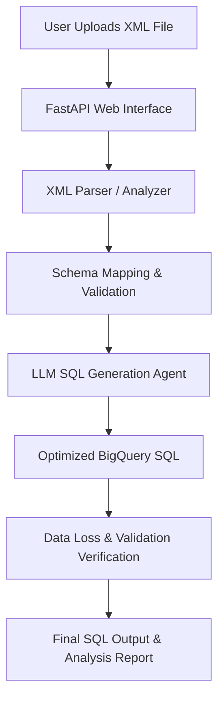

# XML to BigQuery SQL Converter Agent

Welcome to the XML to SQL Converter Agent project!

To proceed with building the agent, please perform the following steps to upload your files and documents:

## 1. Paste Google Doc Contents
Since the Google Docs require authentication and cannot be accessed directly via public HTTP requests, please paste their content into the following placeholder files:
- **BRD Content**: Paste the text/markdown content of the BRD Google Doc into [docs/brd_content.md](file:///C:/Users/rishika.sharma_cloud/.gemini/antigravity-ide/scratch/xml_to_sql_agent/docs/brd_content.md).
- **Example Converted SQL**: Paste the SQL queries and tabs from the SQL converter Google Doc into [docs/example_sql_content.md](file:///C:/Users/rishika.sharma_cloud/.gemini/antigravity-ide/scratch/xml_to_sql_agent/docs/example_sql_content.md).

## 2. Upload Your XML Files
Please copy/paste your XML files into the `data/` folder:
- Place them in [data/](file:///C:/Users/rishika.sharma_cloud/.gemini/antigravity-ide/scratch/xml_to_sql_agent/data/) (e.g., `data/sample1.xml`, `data/sample2.xml`).

---

## Proposed System Architecture

### Key Components of the Proposed Agent:
1. **Web Interface (FastAPI + HTML5/CSS3)**: A beautiful drag-and-drop web UI where you can upload one or multiple XML files and view generated BigQuery SQL queries side-by-side.
2. **Schema & Context Extractor**: A python module that parses the XML structure (handling nested tags, attributes, namespaces, repeating groups) and extracts metadata to ensure no field is missed.
3. **No-Loss Verification Module**: A verification step that compares the generated SQL select fields and source fields to guarantee 100% data coverage (no data loss).
4. **LLM SQL Generator (Gemini)**: Leverages Gemini to produce highly optimized BigQuery standard SQL, utilizing arrays, structs, and appropriate joins for nested XML schemas.
